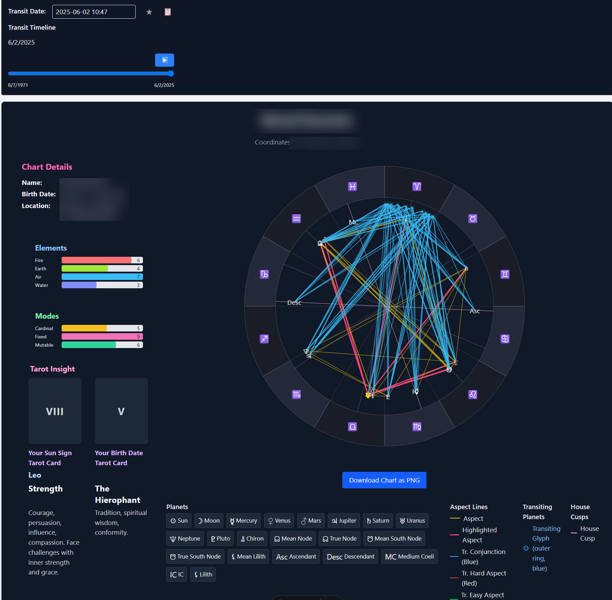

# 🌟 AstroTracker

A modern, full-stack astrology application that provides comprehensive astrological chart generation, analysis, and insights. Built with FastAPI, Astro, and React.

<div align="center">
  
</div>

## ✨ Features

### 🔮 Core Astrological Features
- **Natal Chart Generation**: Complete birth chart calculations with planets, houses, and aspects
- **Synastry Analysis**: Relationship compatibility charts and analysis
- **Interactive Chart Displays**: SVG-based charts with hover tooltips and detailed information
- **Astrological Calculations**: Powered by Swiss Ephemeris for accurate astronomical data
- **Chart Export**: Save charts as PNG images using html-to-image

### 🔐 User Management
- **Google OAuth Authentication**: Secure sign-in with Google accounts
- **User Profiles**: Personalized dashboards and chart storage
- **Session Management**: JWT and cookie-based authentication
- **Account Registration**: Traditional email/password registration option

### 🎨 User Interface
- **Modern Design**: Clean, responsive interface built with Tailwind CSS
- **Interactive Charts**: Click and hover interactions with chart elements
- **Mobile Friendly**: Responsive design that works on all devices
- **Real-time Updates**: Dynamic chart generation and updates

### 🔧 Technical Features
- **RESTful API**: Comprehensive FastAPI backend with OpenAPI documentation
- **Database Management**: PostgreSQL with Alembic migrations
- **Docker Support**: Full containerization for easy deployment
- **Type Safety**: TypeScript frontend with comprehensive type definitions
- **Modern Stack**: Latest versions of React, Astro, and FastAPI

## 🏗️ Technology Stack

### Backend
- **[FastAPI](https://fastapi.tiangolo.com/)** - Modern Python web framework
- **[PostgreSQL](https://www.postgresql.org/)** - Robust relational database
- **[SQLAlchemy](https://www.sqlalchemy.org/)** - Python SQL toolkit and ORM
- **[Alembic](https://alembic.sqlalchemy.org/)** - Database migration tool
- **[FastAPI Users](https://fastapi-users.github.io/)** - Authentication and user management
- **[Swiss Ephemeris](https://www.astro.com/swisseph/)** - Astronomical calculations
- **[Kerykeion](https://github.com/g-battaglia/kerykeion)** - Python astrology library

### Frontend
- **[Astro](https://astro.build/)** - Modern static site generator
- **[React](https://reactjs.org/)** - Component-based UI library
- **[TypeScript](https://www.typescriptlang.org/)** - Type-safe JavaScript
- **[Tailwind CSS](https://tailwindcss.com/)** - Utility-first CSS framework
- **[Zustand](https://github.com/pmndrs/zustand)** - State management
- **[Axios](https://axios-http.com/)** - HTTP client for API requests

### DevOps & Tools
- **[Docker](https://www.docker.com/)** - Containerization platform
- **[Docker Compose](https://docs.docker.com/compose/)** - Multi-container orchestration
- **[Poetry](https://python-poetry.org/)** - Python dependency management
- **[pnpm](https://pnpm.io/)** - Fast, disk space efficient package manager
- **[ESLint](https://eslint.org/)** & **[Prettier](https://prettier.io/)** - Code formatting and linting

## 🚀 Quick Start

### Prerequisites
- **Docker** and **Docker Compose** (recommended)
- **Python 3.11+** and **Poetry** (for local development)
- **Node.js 18+** and **pnpm** (for frontend development)
- **PostgreSQL** (if running locally)

### Option 1: Docker Deployment (Recommended)

1. **Clone the repository**
   ```bash
   git clone https://github.com/your-username/astrotracker.git
   cd astrotracker
   ```

2. **Configure environment variables**
   ```bash
   cp api/.example.env api/.env
   # Edit api/.env with your configuration (see Configuration section)
   ```

3. **Start all services**
   ```bash
   docker-compose up -d
   ```

4. **Access the application**
   - Frontend: http://localhost:4322
   - Backend API: http://localhost:8000
   - API Documentation: http://localhost:8000/docs

### Option 2: Local Development

1. **Clone and setup**
   ```bash
   git clone https://github.com/your-username/astrotracker.git
   cd astrotracker
   ```

2. **Setup PostgreSQL database**
   ```bash
   # Using Docker (recommended)
   docker run -d \
     --name astrotracker_db \
     -e POSTGRES_USER=postgres \
     -e POSTGRES_PASSWORD=password \
     -e POSTGRES_DB=astrotracker_db \
     -p 5432:5432 \
     postgres:15-alpine
   ```

3. **Setup Backend**
   ```bash
   cd api
   
   # Install dependencies
   poetry install
   
   # Configure environment
   cp .example.env .env
   # Edit .env with your settings
   
   # Run database migrations
   poetry run alembic upgrade head
   
   # Start the API server
   poetry run uvicorn app.main:app --reload --host 0.0.0.0 --port 8000
   ```

4. **Setup Frontend**
   ```bash
   cd web
   
   # Install dependencies
   pnpm install
   
   # Start development server
   pnpm dev
   ```

5. **Access the application**
   - Frontend: http://localhost:4321
   - Backend API: http://localhost:8000

## ⚙️ Configuration

### Environment Variables

Create `api/.env` from `api/.example.env` and configure:

#### Required Settings
```env
# Database
POSTGRES_USER=postgres
POSTGRES_PASSWORD=your_secure_password
POSTGRES_SERVER=localhost  # or 'db' for Docker
POSTGRES_PORT=5432
POSTGRES_DB=astrotracker_db

# Security
SECRET_KEY=your_super_secret_key_here  # Generate with: openssl rand -hex 32

# Frontend URL
FRONTEND_URL=http://localhost:4321  # or http://localhost:4322 for Docker
```

#### Google OAuth (Optional)
```env
GOOGLE_OAUTH_CLIENT_ID=your_google_client_id
GOOGLE_OAUTH_CLIENT_SECRET=your_google_client_secret
```

#### Optional Settings
```env
# Monitoring
SENTRY_DSN=your_sentry_dsn

# Astrology API
KERYKEION_API_KEY=your_api_key
```

### Google OAuth Setup

1. **Create Google Cloud Project**
   - Go to [Google Cloud Console](https://console.cloud.google.com/)
   - Create a new project or select existing one

2. **Enable Google+ API**
   - Navigate to "APIs & Services" > "Library"
   - Search for "Google+ API" and enable it

3. **Create OAuth 2.0 Credentials**
   - Go to "APIs & Services" > "Credentials"
   - Click "Create Credentials" > "OAuth 2.0 Client IDs"
   - Choose "Web application"

4. **Configure OAuth Settings**
   - **Authorized JavaScript origins**: `http://localhost:4321`
   - **Authorized redirect URIs**: `http://localhost:4321/auth/callback`
   - For Docker: Also add `http://localhost:4322/auth/callback`

5. **Update Environment**
   - Copy Client ID and Secret to your `.env` file

## 📖 Usage

### Creating Your First Chart

1. **Register or Sign In**
   - Visit the application and create an account
   - Or use "Sign in with Google" for quick access

2. **Generate a Natal Chart**
   - Navigate to the Charts section
   - Enter birth date, time, and location
   - Click "Generate Chart" to create your natal chart

3. **Explore Chart Features**
   - Hover over planets and aspects for detailed information
   - Use the chart details panel for comprehensive analysis
   - Export your chart as a PNG image

### Synastry Analysis

1. **Create Relationship Chart**
   - Go to the Synastry section
   - Enter birth data for both partners
   - Generate compatibility analysis

2. **Interpret Results**
   - Review aspect patterns between charts
   - Explore compatibility scores and insights

## 🔧 Development

### Project Structure

```
astrotracker/
├── api/                    # FastAPI Backend
│   ├── app/
│   │   ├── api/v1/         # API endpoints
│   │   ├── core/           # Core configuration
│   │   ├── db/             # Database models and setup
│   │   ├── models/         # SQLAlchemy models
│   │   └── schemas/        # Pydantic schemas
│   ├── migrations/         # Alembic migrations
│   └── tests/              # Backend tests
├── web/                    # Astro Frontend
│   ├── src/
│   │   ├── components/     # React components
│   │   ├── layouts/        # Astro layouts
│   │   ├── pages/          # Astro pages
│   │   ├── stores/         # Zustand stores
│   │   └── types/          # TypeScript types
│   └── public/             # Static assets
├── docs/                   # Documentation
├── docker-compose.yml      # Multi-container setup
└── README.md              # This file
```

### Development Workflow

1. **Setup Development Environment**
   ```bash
   # Clone and setup dependencies (see Quick Start)
   ```

2. **Make Changes**
   - Backend changes: API automatically reloads
   - Frontend changes: Hot module replacement active
   - Database changes: Create Alembic migrations

3. **Run Tests**
   ```bash
   # Backend tests
   cd api && poetry run pytest
   
   # Frontend linting
   cd web && pnpm lint
   ```

4. **Database Migrations**
   ```bash
   cd api
   
   # Create migration
   poetry run alembic revision --autogenerate -m "Description"
   
   # Apply migration
   poetry run alembic upgrade head
   ```

### API Documentation

- **Interactive Docs**: http://localhost:8000/docs (Swagger UI)
- **ReDoc**: http://localhost:8000/redoc
- **OpenAPI JSON**: http://localhost:8000/openapi.json

### Key Endpoints

- `POST /api/v1/auth/register` - User registration
- `POST /api/v1/auth/cookie/login` - Email/password login
- `GET /api/v1/auth/google/authorize` - Google OAuth start
- `POST /api/v1/charts/natal` - Generate natal chart
- `POST /api/v1/charts/synastry` - Generate synastry chart
- `GET /api/v1/users/me` - Current user profile

## 🐳 Docker Deployment

### Development with Docker

```bash
# Build and start all services
docker-compose up -d

# View logs
docker-compose logs -f

# Rebuild specific service
docker-compose build api
docker-compose restart api

# Stop all services
docker-compose down
```

### Production Deployment

1. **Update Environment**
   ```env
   # In api/.env
   ENVIRONMENT=production
   POSTGRES_SERVER=your_production_db_host
   FRONTEND_URL=https://your-domain.com
   ```

2. **Update OAuth URLs**
   - Add production domain to Google OAuth settings
   - Update redirect URIs accordingly

3. **Deploy with Docker**
   ```bash
   docker-compose -f docker-compose.prod.yml up -d
   ```

## 🔍 Troubleshooting

### Common Issues

#### OAuth "redirect_uri_mismatch"
- **Problem**: Google OAuth returns redirect URI mismatch error
- **Solution**: Ensure redirect URIs in Google Console match your `FRONTEND_URL/auth/callback`

#### Database Connection Issues
- **Problem**: API can't connect to PostgreSQL
- **Solution**: Check `POSTGRES_SERVER` setting (use `db` for Docker, `localhost` for local)

#### Frontend Build Errors
- **Problem**: Missing dependencies during Docker build
- **Solution**: Ensure all dependencies are in `package.json`, run `pnpm install` locally first

#### Chart Generation Errors
- **Problem**: Astrological calculations fail
- **Solution**: Ensure Swiss Ephemeris data files are properly mounted in Docker

### Debug Mode

Enable debug logging:
```env
# In api/.env
LOG_LEVEL=DEBUG
```

View detailed logs:
```bash
docker-compose logs -f api
```

## 🤝 Contributing

We welcome contributions! Please see our [Contributing Guidelines](CONTRIBUTING.md) for details.

### Development Setup
1. Fork the repository
2. Create a feature branch (`git checkout -b feature/amazing-feature`)
3. Make your changes
4. Add tests if applicable
5. Commit your changes (`git commit -m 'Add amazing feature'`)
6. Push to the branch (`git push origin feature/amazing-feature`)
7. Open a Pull Request

### Code Style
- **Backend**: Follow PEP 8, use `black` for formatting
- **Frontend**: Use ESLint and Prettier configurations
- **Commits**: Use conventional commit format

## 📝 License

This project is licensed under the MIT License - see the [LICENSE](LICENSE) file for details.

## 🙏 Acknowledgments

- **Swiss Ephemeris** - For accurate astronomical calculations
- **Astro Community** - For the amazing static site generator
- **FastAPI Team** - For the excellent Python web framework
- **Contributors** - Thank you to all who help improve AstroTracker

## 📞 Support

- **Documentation**: [Wiki](https://github.com/your-username/astrotracker/wiki)
- **Issues**: [GitHub Issues](https://github.com/your-username/astrotracker/issues)
- **Discussions**: [GitHub Discussions](https://github.com/your-username/astrotracker/discussions)

---

**Built with ❤️ for the astrology community**

*Explore the cosmos, understand yourself, and connect with others through the ancient wisdom of astrology.* 